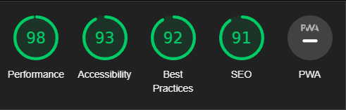
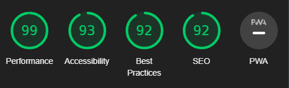

# Mathias Skovgaard Portfolio

#### This project is a personal portfolio website for Mathias Skovgaard, a passionate software developer with a strong background in frontend technologies, project management, and agile methodologies.

## Lighthouse analyze
### Web

### Mobile

## Features

- Responsive design
- Tailwind CSS for styling
- Firebase for deployment
- React.js as the main framework
- Smooth scrolling to different sections
- Email functionality through EmailJS
- Snackbar notifications

## Sections

- Home: Introduction and a background image
- About: A brief biography of Mathias Skovgaard
- Timeline: A timeline of Mathias Skovgaard's earlier workexperience
- Skills: A section about Mathias Skovgaard's skills and experience with different tools
- Contact: A contact form for visitors to get in touch with Mathias Skovgaard

## Dependencies

- React.js
- EmailJS
- Tailwind CSS
- Headless UI
- React-icons
- React-scroll
- React-transition-group

## Setup

1. Clone the repository: `git clone https://github.com/sk0vgaard/mathias-skovgaard-portfolio.git` 
2. Install the dependencies: `npm install`
3. Set up environment variables for EmailJS:

Create a `.env` file in the root of the project and add the following variables:

<ul>
    <li>REACT_APP_EMAILJS_SERVICE_ID=your_service_id</li>
    <li>REACT_APP_EMAILJS_TEMPLATE_ID=your_template_id</li>
    <li>REACT_APP_EMAILJS_PUBLIC_KEY=your_public_key</li>
</ul>

4. Start the development server: `npm start`

Runs the app in the development mode.\
Open [http://localhost:3000](http://localhost:3000) to view it in your browser.

The page will reload when you make changes.\
You may also see any lint errors in the console.

## Deployment
I am using Firebase for deployment of my application.

1. To build the project for production, run: `npm run build` \
This will create a `build` folder containing the production-ready files.
2. To deploy the project to firebase, run: `firebase deploy`

You can deploy the build folder to any hosting provider of your choice.

## Learn More

You can learn more in the [Create React App documentation](https://facebook.github.io/create-react-app/docs/getting-started).

To learn React, check out the [React documentation](https://reactjs.org/).

### Code Splitting

This section has moved here: [https://facebook.github.io/create-react-app/docs/code-splitting](https://facebook.github.io/create-react-app/docs/code-splitting)

### Analyzing the Bundle Size

This section has moved here: [https://facebook.github.io/create-react-app/docs/analyzing-the-bundle-size](https://facebook.github.io/create-react-app/docs/analyzing-the-bundle-size)

### Making a Progressive Web App

This section has moved here: [https://facebook.github.io/create-react-app/docs/making-a-progressive-web-app](https://facebook.github.io/create-react-app/docs/making-a-progressive-web-app)

### Advanced Configuration

This section has moved here: [https://facebook.github.io/create-react-app/docs/advanced-configuration](https://facebook.github.io/create-react-app/docs/advanced-configuration)

### Deployment

This section has moved here: [https://facebook.github.io/create-react-app/docs/deployment](https://facebook.github.io/create-react-app/docs/deployment)

### `npm run build` fails to minify

This section has moved here: [https://facebook.github.io/create-react-app/docs/troubleshooting#npm-run-build-fails-to-minify](https://facebook.github.io/create-react-app/docs/troubleshooting#npm-run-build-fails-to-minify)
